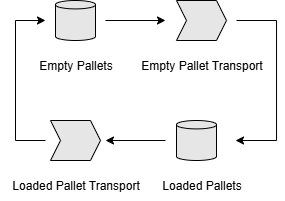

# Chapter 1: Getting Started

Welcome to your first QuokkaSim simulation! In this chapter you will

1. Install Rust
2. Create a new Rust project  
3. Add QuokkaSim as a dependency  
4. Write and run a minimal "hello world" simulation  

---

## 1.1. Install Rust

Follow the instructs on the [Rust Lang website](https://www.rust-lang.org/tools/install) to install Rust on your operating system. These instructions will help you install:

- `rustup`, the Rust installer, and
- `cargo`, the Rust package manager

To check if installation is successful, use ``cargo -V`` to check which version of Cargo you have installed.

## 1.2. Create a new Rust project

If you don’t already have a project, open a terminal and run:

```bash
cargo new hello‐quokkasim
cd hello‐quokkasim
```

This creates a fresh binary crate with ``src/main.rs``.

## 1.3. Add QuokkaSim to Cargo.toml

To add QuokkaSim as a dependency, use ``cargo add quokkasim`` or add the following to your ``Cargo.toml`` file before running ``cargo fetch``:
```toml
[dependencies]
quokkasim = "0.3.0-alpha"
```

## 1.4. Write your first Simulation

In your ``main.rs`` file, paste the following imports which will be used in this example.

```rust,no_run
{{#include ../playground/src/bin/pallet_cycle.rs:preamble}}
```

Next we create the individual interactive components of our simulation
<p align="center"><p>

**Empty Pallets** hold a discrete number of pallets, which **Empty Pallet Transport** moves at specific times, into **Loaded Pallets**. In reality there may be a specific process to load material onto the pallets, but we will consider this negligible for the sake of example. **Loaded Pallet Transport** then moves pallets to **Empty Pallets** and the cycle continues.

Add the following into the `main()` function to create these components, and to connect them together.

```rust,no_run
{{#include ../playground/src/bin/pallet_cycle.rs:components}}
```

Next we'll add some ``Logger`` instances to report on what occurs during the simulation, and connect them to our Process and Stock components.

```rust,no_run
{{#include ../playground/src/bin/pallet_cycle.rs:loggers}}
```

Then we create our `Simulation` object `sim`, which controls the progression of the simulation.

```rust,no_run
{{#include ../playground/src/bin/pallet_cycle.rs:sim}}
```

We send and initialisation events, tell our simulation to run for an hour, and prints the results. Some logic is also included to view the model execution time.

```rust,no_run
{{#include ../playground/src/bin/pallet_cycle.rs:run}}
```

Our `main.rs` file is now complete (or refer to the Full Code below if you think you're missing something).

Finally, use `cargo run` to run the simulation. If you see data logs in the terminal instead of errors, you're done! You can also try a production build and run by using `cargo run --release`, and compare the difference compilation and execution times.

## 1.5. Exercises

Want to start playing around immediately? Here are some ideas of things you can try before moving on with the rest of the book!

- 1 hour is simulated to begin with. What if we simulate for longer?
- What happens if all the pallets begin at **Empty Pallets**?
- What happens if there can only be up to 2 pallets at a time in **Loaded Pallets**? You can use the `.with_max_capacity` method of the stock to configure this.
---

## Full Code
```rust,no_run
{{#include ../playground/src/bin/pallet_cycle.rs:all}}
```